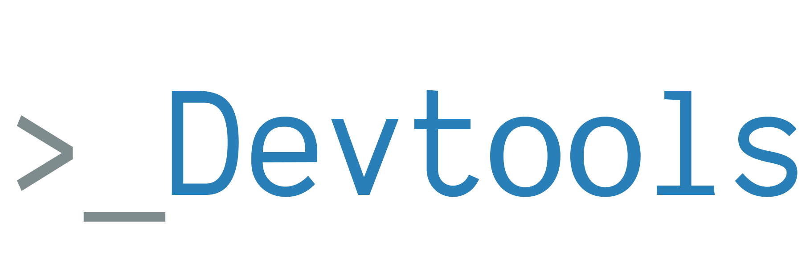

<!-- START social-badges -->

<!-- END social-badges -->

<!-- START banner -->

<!-- END banner -->

<!-- START description -->
<strong>Opinionated</strong> set of common scripts, configurations and 
tools for my JavaScript and TypeScript projects.
<!-- END description -->

<!-- START status-badges -->

<!--  -->
<!-- END status-badges -->

<!-- START packages-versions -->

<!-- END packages-versions -->

## 🤔 Problem

<!-- START the-problem -->

Whenever I start a new project, I usually repeat configuration files or common tasks like testing, building, linting, deploying and code generation. It **sucks** to repeat and maintain all those tasks on all the projects.

<!-- END the-problem -->

## 🤓 Solution

<!-- START the-solution -->

I have created this _monorepo_ powered by [Yarn workspaces](https://yarnpkg.com/lang/en/docs/workspaces/) to share those common tasks and configuration files across my projects. The idea of creating a monorepo it's because if I ever want only an _eslint configuration_, _typescript configuration_, or _code generator_, I just have to install the required package rather than all the devtools, if this were a monolith.

<!-- END the-solution -->

## 📚 Table of Contents

<!-- START doctoc generated TOC please keep comment here to allow auto update -->
<!-- DON'T EDIT THIS SECTION, INSTEAD RE-RUN doctoc TO UPDATE -->

- [📝 Usage](#-usage)
- [📦 Included packages](#-included-packages)
- [🍻 Contributors](#-contributors)
- [✅ Other solutions](#-other-solutions)
- [❤️ Inspiration and special thanks](#-inspiration-and-special-thanks)
- [📄 License](#-license)

<!-- END doctoc generated TOC please keep comment here to allow auto update -->

## 📝 Usage

<!-- START usage -->

Usage instructions are different depending on the [package](#-included-packages) you want to install. This is a _selfdogfooded_ monorepo, so every script, every generator and every configuration file, is loaded from here (cool, isn't it? 🤘🏻).

<!-- END usage -->

## 📦 Included packages

<!-- START included-packages -->

- [@kevinwolf/kw-scripts](./packages/kw-scripts#readme)

  <!-- END included-packages -->

## 🍻 Contributors

Thanks goes to these wonderful people ([emoji key](https://allcontributors.org/docs/en/emoji-key)):

<!-- ALL-CONTRIBUTORS-LIST:START - Do not remove or modify this section -->
<!-- prettier-ignore -->
<table><tr><td align="center"><a href="https://kevinwolf.me"> <b>Kevin Wolf</b></a> <a href="https://github.com/kevinwolfcr/devtools/commits?author=kevinwolfcr" title="Code">💻</a> <a href="#content-kevinwolfcr" title="Content">🖋</a> <a href="#design-kevinwolfcr" title="Design">🎨</a> <a href="https://github.com/kevinwolfcr/devtools/commits?author=kevinwolfcr" title="Documentation">📖</a> <a href="#example-kevinwolfcr" title="Examples">💡</a> <a href="#infra-kevinwolfcr" title="Infrastructure (Hosting, Build-Tools, etc)">🚇</a> <a href="#tool-kevinwolfcr" title="Tools">🔧</a> <a href="#tutorial-kevinwolfcr" title="Tutorials">✅</a></td></tr></table>

<!-- ALL-CONTRIBUTORS-LIST:END -->

This project follows the [all-contributors](https://github.com/all-contributors/all-contributors) specification. Contributions of any kind welcome!

## ✅ Other solutions

If you have any similar solution, feel free to open a PR.

- [kcd-scripts](https://github.com/kentcdodds/kcd-scripts)

## ❤️ Inspiration and special thanks

This project is heavily inspired by [kcd-scripts](https://github.com/kentcdodds/kcd-scripts) and [react-scripts](https://github.com/facebook/create-react-app).

## 📄 License

[MIT](./LICENSE)
